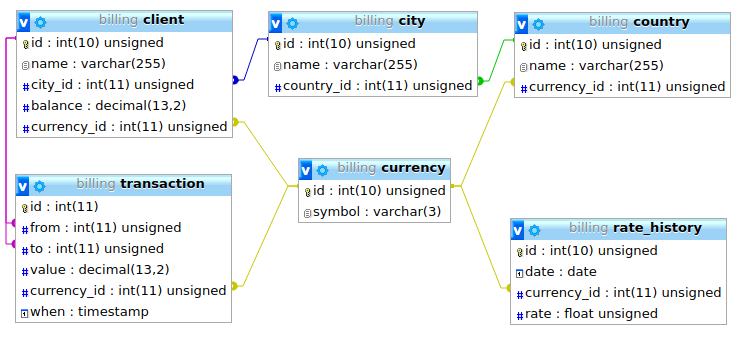

<p align="center">
    <a href="https://github.com/yiisoft" target="_blank">
        
    </a>
    <h1 align="center">Simplest billing system based on Yii 2 Basic Project Template</h1>
    <br>
</p>

DB STRUCTURE
------------



DIRECTORY STRUCTURE
-------------------

      assets/             contains assets definition
      commands/           contains console commands (controllers)
      config/             contains application configurations
      controllers/        contains Web controller classes
      mail/               contains view files for e-mails
      models/             contains model classes
      runtime/            contains files generated during runtime
      tests/              contains various tests for the basic application
      vendor/             contains dependent 3rd-party packages
      views/              contains view files for the Web application
      web/                contains the entry script and Web resources


REQUIREMENTS
------------

The minimum requirement by this project template that your Web server supports PHP 5.4.0.


INSTALLATION
------------

*If (* you happy linux user, you can install this project using the one following command: *) {*

~~~
git clone git@github.com:mixartemev/billing.git && cd billing && sh install.sh root 321
~~~

*} else {*

you should make this steps manually:

**1. Clone project**
~~~
git clone git@github.com:mixartemev/billing.git
~~~
or, if you use http protocol
~~~
git clone https://github.com/mixartemev/billing.git
~~~


**2. Go to project dir**
~~~
cd billing
~~~

**3. Get dependencies**
~~~
composer install
~~~

**4. Configure database access**

Edit the file `config/db.php` with real data, for example:
```php
return [
    'class' => 'yii\db\Connection',
    'dsn' => 'mysql:host=localhost;dbname=billing',
    'username' => 'root',
    'password' => '321',
];
```
*NOTES:*
- Yii won't create the database for you, this has to be done manually before you can access it.
- Check and edit the other files in the `config/` directory to customize your application as required.
- Refer to the README in the `tests` directory for information specific to basic application tests.


**5. Create databese named "billing"**
~~~
mysqladmin -u {mysql_login} -fp{mysql_password} create billing
~~~

**6. Create database structure and fill it**
~~~
./yii migrate
~~~

**7. Set up cron job: daily currency rate logger**
~~~
echo '1 10 * * * {project_dir}/yii cli/get-currency-rates' >> /var/spool/cron/crontabs/`whoami`
~~~
*}*

##### Forward your web server domainName (for example "billing") to "~/billing/web/" dir, and

**Check this out:**
~~~
http://billing/
~~~

DESCRIPTION
-----------

####HTTP API представляет следующие интерфейсы:

##### 1) Регистрация клиента с указанием его имени, страны, города регистрации, валюты создаваемого кошелька.
examlpe:
```
GET http://billing/client/create?name=Ilon&country_id=1&city_id=7
```
- указание страны не обязательно, и даже бессмысленно, эта возможность оставлена исключетельно из требований теста, тк указание города все равно обязательно, страна автоматически установится в зависимости от города, больше того, при указании города, находящегося не в выбранной стране, метод вернет ошибку BadRequest.
- указание валюты так же не обязательно, по-умолчанию для клиента установится валюта страны выбранного города, но использование любой другой валюты допускается.

##### 2) зачисление денежных средств на кошелек клиента
examlpe:
```
GET http://billing/client/charge?id=1&amount=50.45
```
- указание валюты здесь не требуется, зачисление на счет клиента происходит только в валюте клиента.

##### 3) перевод денежных средств с одного кошелька на другой.
examlpe:
```
GET http://billing/client/send?senderId=1&recipientId=2&amount=50.45&currencyId=3
```
- указание валюты транзакции не обязательно, по-умолчанию установится валюта получателя, можно и указать принудительно, но только валюту либо получателя, либо отправителя, а иначе - правильно, BadRequest(#400)!

##### 4) загрузка котировки валюты к USD на дату
example:
```
GET http://billing/rate-history/rate?currencyId=2&date=2018-05-21
```
Если дата не указана, будет возвращена котировка на сегодня (или на вчера, если сегодня еще утро до 10ч)

#### Отчет отображает историю всех операций по кошельку указанного клиента за период.
- Параметры: Имя клиента (обязательный параметр), Начало периода (необязательный параметр), конец периода (необязательный параметр).
- Выводится общая сумма операций по счету за период в USD и валюте счета
- Результат отчета можно экспортировать в файл CSV